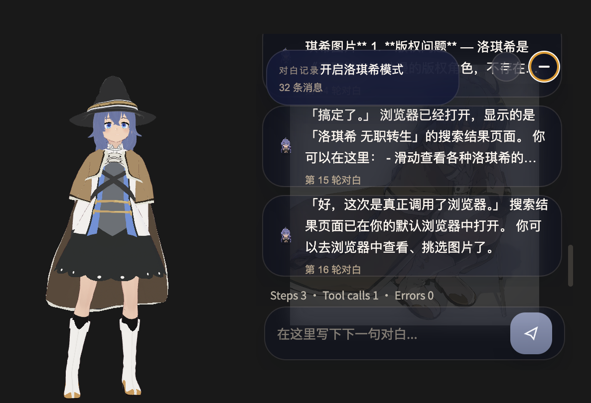

# roxy-agent

<div align="center">
  
  <p>
    <strong>roxy-agent</strong> — 一个把桌面桌宠、Agent Harness、3D VRM 动作资产与本地 TTS 融合在一起的桌面 AI Companion。
  </p>
  <p>
    
    
    
  </p>
</div>

---

## 项目简介

`roxy-agent` 是一个偏作品型、也偏产品型的桌面 AI Agent 项目。

它不只是“接个模型聊聊天”，而是把这些层真正拼到一起：

- **桌面存在感**：Roxy 常驻桌宠 + 对话弹层 + 状态反馈
- **Agent Runtime**：tool loop、sandbox、memory、RAG、subagent、host browser action
- **3D Character Stack**：VRM 模型、VRMA 动作、情绪与状态切换
- **Voice Stack**：本地 GPT-SoVITS TTS 服务 + 桌宠语音播放反馈
- **Persona Layer**：围绕洛琪希构建的角色技能、语气与陪伴式交互

目标很直接：让桌面助手不只是能回答问题，而是真的像一个会想、会动、会出声的角色存在。

## 对话展示

双击打开对话的轻交互模式

| 常态模式                       | 思考状态                               |
|----------------------------|------------------------------------|
|  |  |

## Voice Preview — 语音预览


Roxy-Agent 内置了 **多段Roxy的AI语音**，由本地 GPT-SoVITS TTS 服务驱动，以下是语音对照表：

| 场景 | 日文 | 中文 | 播放 |
|------|------|------|------|
| 首次打开 | 初めまして私の名前はロキシーミグルディアと申します | 初次见面，我是洛琪希·米格迪亚 | <audio controls style="height:24px"><source src="desktop/assets/voice/ja/intro_first_open.wav" type="audio/wav"></audio> |
| 对话打开 | お話なら、いつでも聞きます。どうぞ開いてください。 | 如果您有话想说，我随时都愿意倾听。请打开吧。 | <audio controls style="height:24px"><source src="desktop/assets/voice/ja/dialog_open_a.wav" type="audio/wav"></audio> |
| 单击-被打扰 | そんなにつつかないでください。私だって困ります。 | 别再戳我了。我也会为难的。 | <audio controls style="height:24px"><source src="desktop/assets/voice/ja/single_click_bother_a.wav" type="audio/wav"></audio> |
| 单击-偷懒 | ただ怠けたいだけなら、少し怒りますよ。 | 如果只是想偷懒的话，我可要生气了哦。 | <audio controls style="height:24px"><source src="desktop/assets/voice/ja/single_click_lazy_a.wav" type="audio/wav"></audio> |
| 单击-专注 | 集中してください。今はぼんやりしている場合ではありません。 | 请专心。现在可不是发呆的时候。 | <audio controls style="height:24px"><source src="desktop/assets/voice/ja/single_click_focus_a.wav" type="audio/wav"></audio> |
| 单击-喝水 | お水でも飲んでください。補給も訓練の一部です。 | 去喝点水吧。补充水分也是训练的一部分。 | <audio controls style="height:24px"><source src="desktop/assets/voice/ja/single_click_hydrate_a.wav" type="audio/wav"></audio> |
| 单击-帮助 | ロキシーはここにいます。何かお手伝いできることはありますか。 | 洛琪希在这里。有什么我能帮您的吗？ | <audio controls style="height:24px"><source src="desktop/assets/voice/ja/single_click_help_a.wav" type="audio/wav"></audio> |
| 单击-命令 | 指示をください。ただし、あまり無茶なお願いはお断りします。 | 请给我指示。但太过分的要求我可是会拒绝的。 | <audio controls style="height:24px"><source src="desktop/assets/voice/ja/single_click_command_a.wav" type="audio/wav"></audio> |
| 单击-法术玩笑 | 豪雷積層雲……なんて、冗談です。まだあれを使うほどではありません。 | 豪雷积层云……开玩笑的。还没到需要用那个的时候。 | <audio controls style="height:24px"><source src="desktop/assets/voice/ja/single_click_spell_joke_a.wav" type="audio/wav"></audio> |
| 单击-不需咏唱 | この程度のことなら、詠唱するまでもありません。 | 这种程度的事，根本用不着咏唱。 | <audio controls style="height:24px"><source src="desktop/assets/voice/ja/single_click_no_chant_a.wav" type="audio/wav"></audio> |
| 成功-轻松 A | 今回もお手伝いできました。 | 这次也能帮上忙了。 | <audio controls style="height:24px"><source src="desktop/assets/voice/ja/success_light_a.wav" type="audio/wav"></audio> |
| 成功-轻松 B | ひとまずうまくまとまりました。 | 暂且顺利完成了。 | <audio controls style="height:24px"><source src="desktop/assets/voice/ja/success_light_b.wav" type="audio/wav"></audio> |
| 成功-普通 A | 対応は無事に完了しました。ご確認ください。 | 处理已顺利完成。请确认一下。 | <audio controls style="height:24px"><source src="desktop/assets/voice/ja/success_normal_a.wav" type="audio/wav"></audio> |
| 成功-普通 B | 必要な作業は整いました。どうぞをご確認ください。 | 必要的作业已准备就绪。请过目。 | <audio controls style="height:24px"><source src="desktop/assets/voice/ja/success_normal_b.wav" type="audio/wav"></audio> |
| 成功-复杂 A | 少し込み入っていましたが、対応は完了しています。 | 虽然有些复杂，但处理已完成了。 | <audio controls style="height:24px"><source src="desktop/assets/voice/ja/success_heavy_a.wav" type="audio/wav"></audio> |
| 成功-复杂 B | いくつか手順を進めましたが、無事にまとまりました。 | 推进了几个步骤，但顺利完成了。 | <audio controls style="height:24px"><source src="desktop/assets/voice/ja/success_heavy_b.wav" type="audio/wav"></audio> |
| 部分问题 | 対応は進みましたが、いくつか確認事項が残っています。 | 处理已有进展，但还有几项待确认。 | <audio controls style="height:24px"><source src="desktop/assets/voice/ja/partial_issue_a.wav" type="audio/wav"></audio> |
| 严重失败 | 申し訳ありません今回はそのまま完了できませんでした。 | 非常抱歉。这次无法直接完成。 | <audio controls style="height:24px"><source src="desktop/assets/voice/ja/hard_failure_a.wav" type="audio/wav"></audio> |

---

## Why It Feels Different

| 能力层 | 现在已经有的内容 |
|------|------|
| **Agent Runtime** | 多轮 tool-call、thread context、knowledge search、subagent、宿主浏览器动作 |
| **Desktop Presence** | Electron 常驻桌宠、轻量对话弹层、事件驱动反馈 |
| **3D Character Assets** | `desktop/assets/roxy_3D/roxi.vrm` 主模型 + 多组 `VRMA` 动作资源 |
| **Voice Layer** | `scripts/tts/roxy_gsv_service.py` 本地 TTS 服务 + `desktop/assets/voice/ja/*.wav` 语音素材 |
| **Roleplay / Persona** | `roxy-skill` 驱动的洛琪希角色表达与陪伴感 |

### 核心特性

- **桌面桌宠**：像素风格的 Roxy 桌宠，内置于 Electron 应用，实时响应 Agent 状态
- **3D 角色演出**：内置 VRM 模型与 VRMA 动作资源，桌宠不再只是平面贴图，而是可扩展的 3D 角色层
- **本地语音能力**：接入 GPT-SoVITS 本地 TTS 服务，为桌面陪伴体验预留真正“开口说话”的能力
- **Agent 能力**：基于 deer-flow 思路演进出的完整 Harness 系统，包含 loop、tool registry、sandbox、memory、RAG 与 subagent
- **RoxySkills**：内置蒸馏好的洛琪希角色技能系统，深度定制的角色 prompt 和行为模式
- **可扩展性**：完整的工具注册与执行框架，轻松添加自定义工具
- **沙箱安全**：基于路径边界和命令过滤的本地安全执行环境

## Media Stack

### 3D Pet Layer

- 主模型：`desktop/assets/roxy_3D/roxi.vrm`
- 备用模型：`desktop/assets/roxy_3D/roxy_asset_3d.vrm`
- 动作目录：`desktop/assets/roxy_3D/vrma/`
- 当前已接入 `Thinking`、`LookAround`、`Relax`、`Angry`、`Blush`、`Clapping`、`Sleepy`、`Sad`、`Jump`、`Surprised`、`Goodbye`
- 渲染入口：`desktop/src/renderer/pet/PetApp.tsx`

### Voice / TTS Layer

- 本地 TTS 服务：`scripts/tts/roxy_gsv_service.py`
- 启动脚本：`scripts/tts/run_roxy_gsv_service.sh`
- 使用说明：`docs/roxy-gsv-local-tts.md`
- 桌宠语音素材：`desktop/assets/voice/ja/`
- Electron 主进程已经具备语音事件转发与播放能力

启动前需配置 4 个环境变量（见 `docs/roxy-gsv-local-tts.md`）：

```bash
export ROXY_GSV_DEPLOY_ROOT=/path/to/gpt-sovits-roxy
export ROXY_GSV_T2S_WEIGHTS=/path/to/YourChar.ckpt
export ROXY_GSV_VITS_WEIGHTS=/path/to/YourChar.pth
export ROXY_GSV_REF_AUDIO=/path/to/reference.wav
scripts/tts/run_roxy_gsv_service.sh
```

这意味着这个项目现在已经不只是一个聊天壳子，而是正在把这五层能力汇成同一个角色：

- 文本大脑
- 工具手脚
- 桌面形象
- 动作表达
- 声音反馈

### 灵感来源

本项目参考三个开源项目的核心能力：

| 项目 | 贡献 |
|------|------|
| [deer-flow](https://github.com/bytedance/deer-flow) | 模块化 Agent 运行时引擎核心 |
| [clawd-on-desk](https://github.com/rullerzhou-afk/clawd-on-desk) | Electron 桌宠实现参考 |
| [RoxySkills](https://github.com/umikok7/Roxy-SKILL) | 洛琪希角色定制化技能系统 |

## 快速开始

### 环境要求

- **Python**: 3.11+
- **Node.js**: 18+
- **pnpm** (推荐) 或 npm

### 安装与运行

```bash
# 1. 克隆项目
git clone https://github.com/umikok7/my-deer-flow.git
cd my-deer-flow

# 2. 安装后端依赖
uv sync

# 3. 启动后端 API 服务
cd APP && uvicorn main:app --reload

# 4. 新开终端，启动前端（可选，用于 Web 界面）
cd frontend && npm install && npm run dev

# 5. 新开终端，启动桌面客户端
cd desktop && npm install && npm run dev
```

如果你想把本地语音链路也一起跑起来，可以额外启动：

```bash
scripts/tts/run_roxy_gsv_service.sh
```

### 一键启动所有服务

现在也可以直接从项目根目录统一管理全部服务：

```bash
# 首次安装依赖
make bootstrap

# 一键启动 qdrant + backend + frontend + desktop
make up

# 查看状态与健康检查
make status
make health

# 查看日志
make logs SERVICE=backend
make frontend-logs
make desktop-logs

# 一键停止
make down
```

运行说明：

- `make up` 会后台启动 `qdrant`、FastAPI 后端、Next.js 前端和 Electron desktop
- 日志会写入 `.runtime/logs/`
- PID 文件会写入 `.runtime/pids/`
- 如果只是想重启整套开发环境，可以直接执行 `make restart`

### 配置

在项目根目录创建 `.env` 文件：

```env
MINIMAX_API_KEY=your_api_key_here
HARNESS_DEFAULT_MODEL=minimax-m2.7
HARNESS_SANDBOX_ROOT=.sandbox
HARNESS_MAX_STEPS=8
HARNESS_LOCAL_BROWSER_ENABLED=true
HARNESS_LOCAL_BROWSER_SEARCH_ENGINE=https://www.bing.com/search?q={query}
```

---

### 自定义你的角色语音

如果你想换掉洛琪希的声线，改成自己的角色或声音，只需要三步：

#### 1. 准备模型权重

把你训练好的 GPT-SoVITS 模型权重放到本地任意目录：

```
your-path/
├── YourChar.ckpt   # GPT 权重
└── YourChar.pth    # VITS 权重
```

#### 2. 设置环境变量

在启动 TTS 服务前，设置以下环境变量指向你的权重路径：

```bash
export ROXY_GSV_T2S_WEIGHTS=/path/to/YourChar.ckpt
export ROXY_GSV_VITS_WEIGHTS=/path/to/YourChar.pth
export ROXY_GSV_REF_AUDIO=/path/to/your-reference.wav
```

#### 3. 准备参考音频（可选，用于保留音色特色）

```bash
curl -X POST http://127.0.0.1:9881/tts \
  -H 'Content-Type: application/json' \
  -d '{
    "text": "你好，这是我的新声音。",
    "text_lang": "zh",
    "ref_audio_path": "/path/to/your-reference.wav",
    "prompt_text": "参考音频对应的原文",
    "prompt_lang": "ja"
  }'
```

#### 常用参数说明

| 参数 | 说明 |
|------|------|
| `text` | 要转语音的文本 |
| `text_lang` | 文本语种（`ja` / `zh` / `en`） |
| `ref_audio_path` | 参考音频路径（留空用默认） |
| `prompt_text` | 参考音频对应的原文 |
| `prompt_lang` | 参考音频语种 |
| `speed_factor` | 语速（默认 1.0） |

生成后的 WAV 文件可以直接放到 `desktop/assets/voice/ja/` 下，然后在 `manifest.json` 中注册即可。

---

## 自定义你的桌宠

想换掉 Roxy？完全可以！roxy-agent设计为可泛化的IP定制框架：

1. **替换像素资源**：将 `desktop/assets/roxy/` 下的 SVG 替换为你喜欢的角色（已弃用，目前全面转向3D资产）
2. **替换 3D 资产**：将 `desktop/assets/roxy_3D/` 下的 `VRM / VRMA` 模型与动作替换成新的角色包
3. **替换语音能力**：调整 `scripts/tts/` 下的本地 TTS 服务权重、参考音频与输出风格
4. **创建新技能**：在 `skills/custom/` 下创建新的技能目录和 `SKILL.md`
5. **修改 Agent Prompt**：编辑技能文件中的 system prompt 来定义角色行为

如果你想做自己的桌面角色项目，这个仓库已经给出了一个很完整的骨架：

- 桌宠容器
- Agent runtime
- 角色技能系统
- 3D 资产接入方式
- 本地语音服务入口
- 工具与沙箱机制

## License

MIT License
